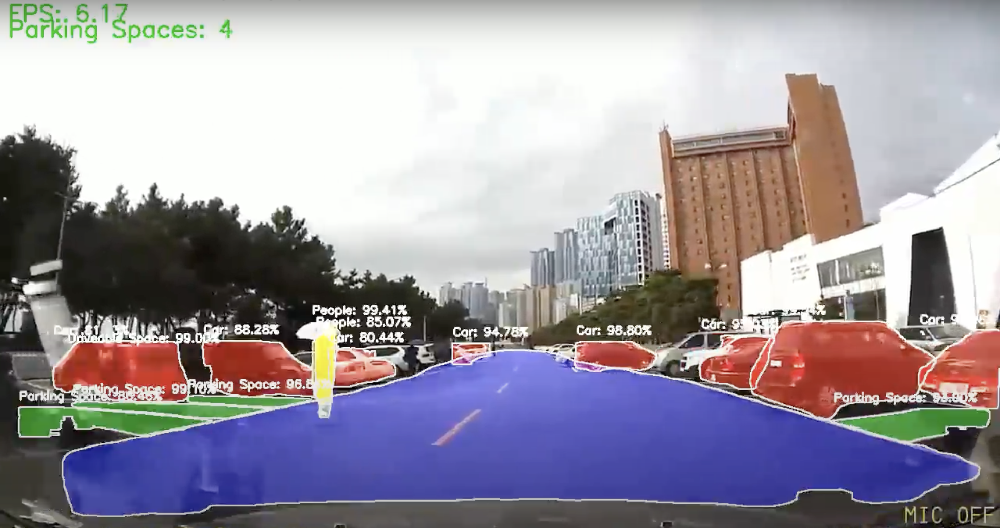

## 🚙 Parking Space Detection Project using Image Processing and Object Recognition

**Team Name:** 기둥 뒤에 공간 있어요!  
**Project Duration:** August 20, 2024 - September 9, 2024  
**Team Members:**  
- **마석빈 (Team Lead):** Model building, visualization development, data preprocessing.  
- **김서희:** Data analysis, YOLO data preprocessing, model training, log management.  
- **박달님:** Data preprocessing, model training, image augmentation.  
- **이윤제:** Data preprocessing (excluding YOLO), model training, log management, image augmentation.

## 🔍 Project Overview
This project focuses on detecting parking spaces using both traditional image processing techniques and deep learning-based object recognition algorithms. Our objective is to develop an AI model for autonomous vehicles capable of accurately detecting and classifying parking spaces, driveable spaces, pedestrians, and vehicles.

## 💻 Technical Stack

### Programming Languages & Frameworks

    
    
    

### Computer Vision & GPU

    
    

## 📼 Demo
👉 [Watch the demo video in here!](https://drive.google.com/drive/folders/1Vg_oa_r5s_gYFnLBLm-cYhLv_40ciIT6)

---

## 📊 Dataset & References

- **AI Hub Parking Space Dataset:** [AI Hub Data Link](https://www.aihub.or.kr/aihubdata/data/view.do?currMenu=115&topMenu=100&dataSetSn=598)
- Reference 1: https://dacon.io/en/competitions/official/235672/codeshare/1795
- Reference 2: https://lyclyc52.github.io/SANeRF-HQ/
